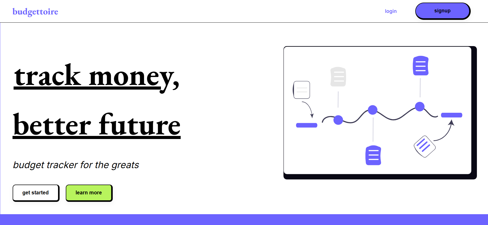
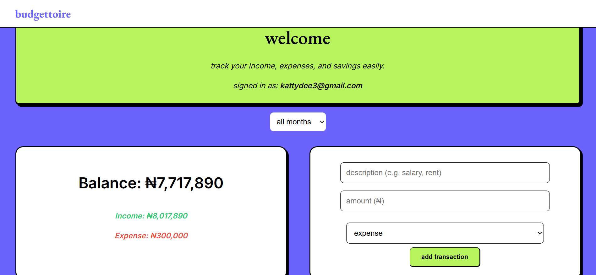
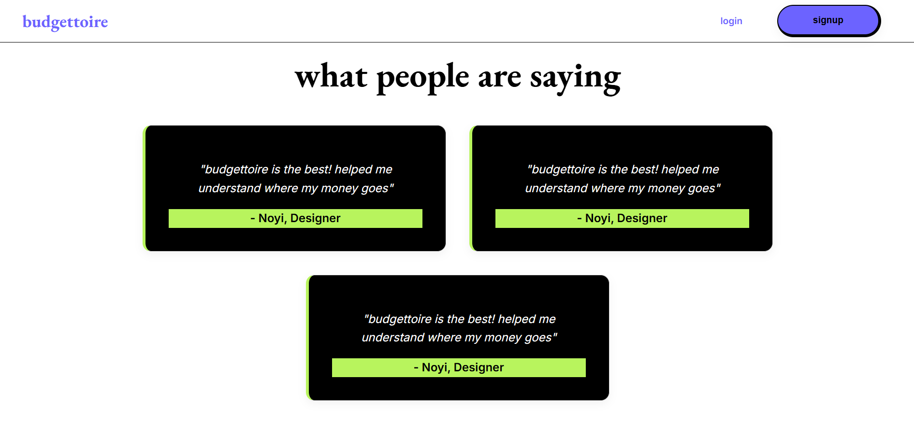
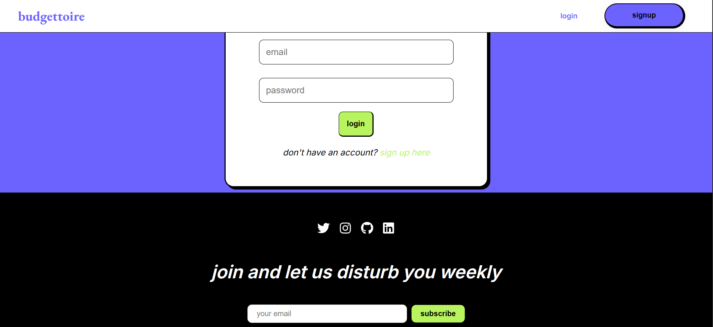

# Budgettoire 💸

**Budgettoire** is a simple and stylish budgeting web app that helps users track their income, expenses, and overall financial habits. Built with React and Firebase, it allows users to log transactions, view summaries, and stay accountable with their goals — all in a clean, responsive interface.

## 🌟 Features

- ✅ User authentication (Firebase Auth)
- 📊 Real-time tracking of income and expenses
- ✍️ Add and delete transactions
- 📅 Filter by month
- 📈 Visual summaries with charts (coming soon)
- 📱 Mobile responsive layout
- ✨ Stylish UI with modular components

## 🚀 Tech Stack

- React
- Firebase (Auth + Firestore)
- React Router
- CSS Modules
- Vercel (Deployment)

## 📷 Screenshots






## 📦 Installation

```bash
git clone https://github.com/your-username/budgettoire.git
cd budgettoire
npm install
npm start
